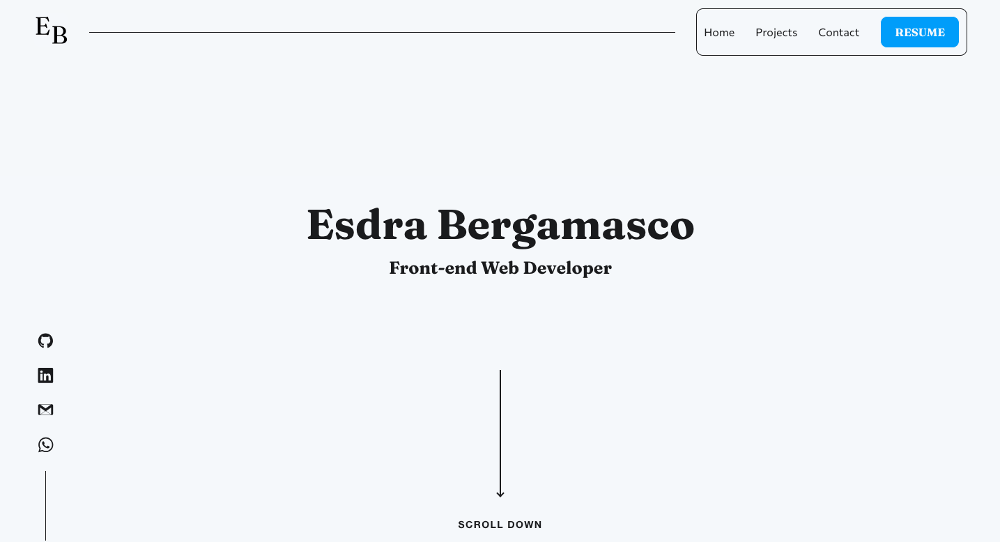

# Esdra Bergamasco - Portfolio

I built from scratch my own website, fully responsive with a focus on micro-interactions. I choose to not use any framework and reserving them for other project. My portfolio aim to show my abilities as a front-end developer but in it you can also find a collection of all my other projects I consider worth showcasing.

## Table of contents

-    [Overview](#overview)
     -    [Screenshot](#screenshot)
     -    [Links](#links)
-    [My process](#my-process)
     -    [Built with](#built-with)
     -    [Continued development](#continued-development)
-    [Author](#author)

## Overview

I started building my portfolio on Figma, after putting togheter my thounghts and a few sketches I finally came up with the blueprint. From that I started building it from a blank vite react template preset. I used Sass and scss modules to style it while Framer helped me create the various animation. Using Formik in combination with Yup for validation and EmailJs to send email I implemented a contatc form for various type of feedback.

### Screenshot

### Links

-    Solution URL: [Solution](https://github.com/esdra00/my-portfolio)
-    Live Site URL: [Live Site](https://www.esdrabergamasco.com/)

## My process

### Built with

-    Semantic HTML5 markup
-    CSS custom properties
-    Mobile-first workflow
-    [React](https://reactjs.org/) - JS library
-    [Sass](https://sass-lang.com) - Css Preprocessor
-    [Formik](https://formik.org) - Form library for React and React Native
-    [Yup](https://github.com/jquense/yup) - Schema builder for runtime value parsing and validation
-    [Framer Motion](https://www.framer.com/motion/animation/) - Motion library for React
-    [EmailJs](https://www.emailjs.com) - Backend-as-a-service to send emails from your client or server-side code
-    [Firebase](https://firebase.google.com) - App development platform 

### Continued development

In the future I want to focus on micro-interactions and animation to improve the user-experience on my portfolio. I will also keep an eye on bugs and errors.

## Author

-    Website - [esdrabergamasco.com](https://www.esdrabergamasco.com)
-    Frontend Mentor - [@esdra00](https://www.frontendmentor.io/profile/esdra00)
-    Github - [@esdra00](https://github.com/esdra00)
